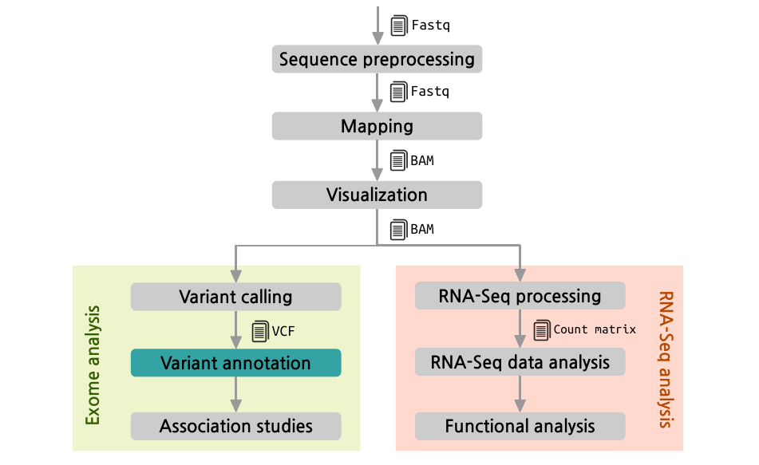
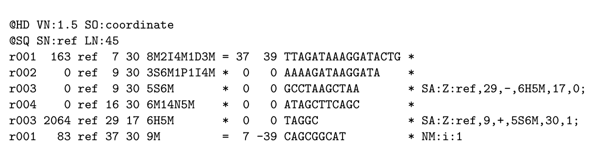
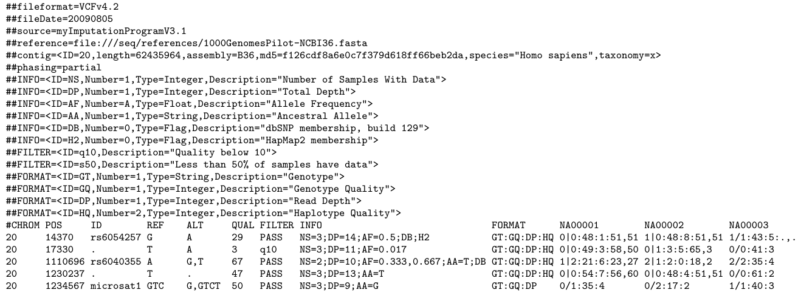

- RNA-seq / Transcriptomics
    + Quantitative: genes, miRNAs, small RNA, transcription factors ...
    + Descriptive: presence / absence
    + Alternative splicing
	+ _variant calling_
- Metatranscriptomics

---

DNA
---

- _De novo_ sequencing
- Resequencing : Mutation or variant calling
    + Whole genome
    + Exome
    + Targeted sequencing
- Copy number alterations
- ChIP-seq / Epigenomics
    + Protein-DNA interactions
    + Active transcription factor binding sites
    + Histone methylation
    + CpG island methylation
- Metagenomics
    + 16S, 18S, viruses
    + full bacterial genomes


General considerations
================================================================================

- Genomic material (DNA/RNA) extraction:
    + amplification
	+ copy or replication (complementary reverse)
	+ multiplexing
	+ adapters
	+ capture using primers

- NGS _reads_ are (ideally) a __random__ selection of the purified DNA/RNA molecules prepared in laboratory ...  
  Think about your experimental context

---

- Reference "genome" is always useful (if exists)
    + map reads against the reference "genome" (transcriptome or database)
	+ assembly reads into a reference "set" of sequences
	+ assembly based in a _close_ reference

- Adapters or primers may be present in our data

- Paired-end or single-end

- Advantages and disadvantages over DNA __microarrays__


General Analysis Pipeline
================================================================================




Data processing steps: common
================================================================================

- File parsing: proprietary formats (``sff``, ``fasta + qual``...) to ``fastq``
- Split [multiplexed](http://www.illumina.com/technology/multiplexing_sequencing_assay.ilmn "Multiplex Sequencing Assay") samples  

<!--  -->

- Quality Control of the raw data
- Adapter trimming
- Filtering and trimming reads by quality
- Quality Control of the trimmed and filtered reads

<!--  -->

- Prepare a reference
    + download genome, miRNAs... form database
    + assemble
	+ __index the reference__
- Alignment / Map against the reference
- Quality Control of the mapping
- Visualization of the mapping


Data processing steps: specific
================================================================================

Transcriptomics
---------------

- Gene, transcript, isoform ... quantification or detection
- Gene, transcript, isoform ... discovery


Genomics
--------

- Variant calling: SNPs, InDels
- Copy number estimation

- Annotation


Analysis
--------

- Statistical analysis
- Functional interpretation
    + GSA
	+ Pathways analysis
	+ Protein networks


Statistical analysis
================================================================================

Transcriptomics
---------------

- Starts with a data matrix of *continuous* expression levels
- Usually in a tab delimited file

- Gene filtering

- Differential expression analysis
- Clustering ...


Genomics
--------

- Starts with a data matrix of **discrete** variant calls
- Usually in a **VCF** file format

- Variant filtering or prioritization: SIFT / PolyPhen, data bases ...

- Association analysis
- Principal component analysis ...


File formats:
================================================================================

- Fasta : sequence (reference)
- FastQ : sequence + quality (__raw reads__)
- SAM / BAM : Sequence Alignment Map format
- VCF : Variant Call Format
- PED & MAP : pedigree files (variants + phenotype
- Tab separated files : matrices / data frames
- Annotation formats (annotation of the reference)
    + [BED] : annotation for genomic regions
    + [GFF] : General Feature Format
    + [GTF] : Gene Transfer Format

---

Some Remarks about formats
------------------------------------

- Different types of compression and _indexing_ may be necessary or useful to handle 
data files.

- Text file in tabular formats are always used

- All standards are not consensus ones they are __de facto__ accepted

\  

See more file formats at
<http://genome.ucsc.edu/FAQ/FAQformat.html>


File formats: Fasta & FastQ
================================================================================

__Fasta__


```
>SEQ_ID
GATTTGGGGTTCAAAGCAGTATCGATCAAATAGTAAATCC
```

\  


__FastQ__


```
@SEQ_ID
GATTTGGGGTTCAAAGCAGTATCGATCAAATAGTAAATCC
+
!''*((((***+))%%%++)(%%%%).1***-+*''))**
```


File formats: SAM (BAM)
================================================================================

TAB-delimited file with an optional **header section** and an **alignment section**



May be compressed and indexed using ``samtools``


File formats: SAM (BAM)
========================================

The alignment of each read is described in a row of the file by **11 fields**:

1.  QNAME: read name
2.  [FLAG: bitwise flag](http://picard.sourceforge.net/explain-flags.html)
3.  RNAME: chromosome
4.  POS: leftmost genomic position
5.  MAPQ:	mapping quality ([Phred scale][phred-quality-score-wikipedia])
6.  CIGAR: CIGAR string (gaps, clipping)
7.  RNEXT: paired read name
8.  PNEXT: paired read position
9.  TLEN: total length of template
10. SEQ: read base sequence
11. QUAL: read base quality


File formats: VCF
================================================================================

Tab delimited text file with a **header section**



May be compressed and indexed using ``tabix``


File formats: VCF
========================================

Each variant is described by **8 fields**

1. CHROM: chromosome
2. POS: position
3. ID: name
4. REF: reference base(s)
5. ALT: non-reference alleles

6. QUAL: quality score of the calls (phred scale)
7. FILTER: PASS / filtering_tag
8. INFO: additional information 


**Genotype data** for several samples may be included in 
a batch of additional columns (one for each sample)
preceded by a FORMAT column which describes their format.


File formats: VCF INFO column
========================================

May include several semicolon separated fields
containing information about the variants coded in key value style:

    <key>=<data>[,data]

Some reserved (but optional) keys are:

- AA ancestral allele
- AC allele count in genotypes, for each ALT allele, in the same order as listed
- AF allele frequency
- CIGAR cigar string describing how to align an alternate allele to the reference allele
- DB dbSNP membership
- MQ RMS mapping quality, e.g. MQ=52
- MQ0 Number of MAPQ == 0 reads covering this record

<!--
- NS Number of samples with data
- SB strand bias at this position
- SOMATIC: indicates that the record is a somatic mutation
- VALIDATED validated by follow-up experiment
-->


File formats: PED & MAP
================================================================================

Classic format to represent genomic variants for several individuals

\includegraphics[scale=.25]{images/ped-map.png}

\small

Some variants of the format are described depending on the software used to read or write them.
Those variants may include _transposed_ versions of the format which is 
closer to standard _genomic_ representation of this kind of information.


File formats: PED & MAP
================================================================================

PED file
---------

1. Family ID
2. Individual ID
3. Paternal ID
4. Maternal ID
5. Sex (1=male; 2=female; other=unknown)
6. Phenotype (1=unaffected; 2=affected; 0 missing; -9=missing)
7. ... genotypes ...


MAP file
--------

1. chromosome (1-22, X, Y or 0 if unplaced)
2. rs... or SNP identifier
3. Genetic distance (Morgans)
4. Base-pair position (bp units)


NGS Data Analysis Software I
================================================================================

- [FastQC] : A quality control tool for high throughput sequence data.
- [cutadapt] : A tool that removes adapter sequences from DNA sequencing reads.
- [FASTX Toolkit] : A collection of command line tools for Short-Reads FASTA/FASTQ files preprocessing.

<!-- -->

- [Bowtie 2] : Tool for aligning sequencing reads to long reference sequences.
- [TopHat] : A fast splice junction mapper for RNA-Seq reads. Depends on Bowtie or [Bowtie 2].
- [BWA] (Burrows-Wheeler Aligner) : A software package for mapping low-divergent sequences against a large reference genome.


NGS Data Analysis Software II
================================================================================

- [SAMtools] : Tool for aligning sequencing reads to long reference sequences.
- [Picard] : Java-based command-line utilities to manipulate SAM files.
- [VCFtools] : A package for working with VCF files: merging, comparing, annotating ...
- [tabix] : tabix: compress and index TAB-delimited files. Useful for handling GFF, GTF, BED and VCF files.

<!-- -->

- [Cufflinks] : Transcript assembly, differential expression, and differential regulation for RNA-Seq
- [GATK] (Genome Analysis Toolkit): A package to analyze next-generation re-sequencing data, primary focused on variant discovery and genotyping.


NGS Data Analysis Software III
================================================================================

- [CuffDiff] : Transcript assembly, differential expression, and differential regulation for RNA-Seq
- [PLINK] : whole genome association analysis.

<!-- -->

- [IGV] (Integrative Genomics Viewer): a visualization tool for interactive exploration of large, integrated genomic datasets. 

<!-- -->

- DWGSIM: simulate datasets

<!--
dwgsim -N 10000 -1 100 -2 100 -y 0.0 -r 0.001 -d 300 seleccion_casos.fa f011_case
dwgsim -N 10000 -1 100 -2 100 -y 0.0 -r 0.001 -d 300 seleccion_casos.fa f012_case
dwgsim -N 10000 -1 100 -2 100 -y 0.0 -r 0.001 -d 300 seleccion_casos.fa f013_case
 -->


NGS Software Installation
================================================================================

Generally download binaries ...

    ./configure

     make (install)

You may: 

- Call directly to the binary or executable files

- Make them accessible via the __PATH__ variable of the shell
using for instance the ``.profile`` file in your home: 

    export PATH=/path/to/bin/dir:$PATH

Or use __configuration files__ `.profile` (better than `.bashrc`)

\  

Some hints here: 
<https://github.com/biocosas/ngs_software_installation>


Useful Linux commands
================================================================================

- cut : to get some fields from a tabular text file
- wc . to count the number of lines in a file
- grep : to find lines in a file with certain pattern
- md5 : to check that files have been properly downloaded
- head / tail : to "see" fists or last lines in a text file

Execute java programs;
    
    java -jar MY_COMPILED_JAVA.jar <program options>


Databases
================================================================================

- [NCBI web page](http://www.ncbi.nlm.nih.gov/sra) for reference genomes.

- 1000 genomes project

- Sequence Read Archive (SRA)

